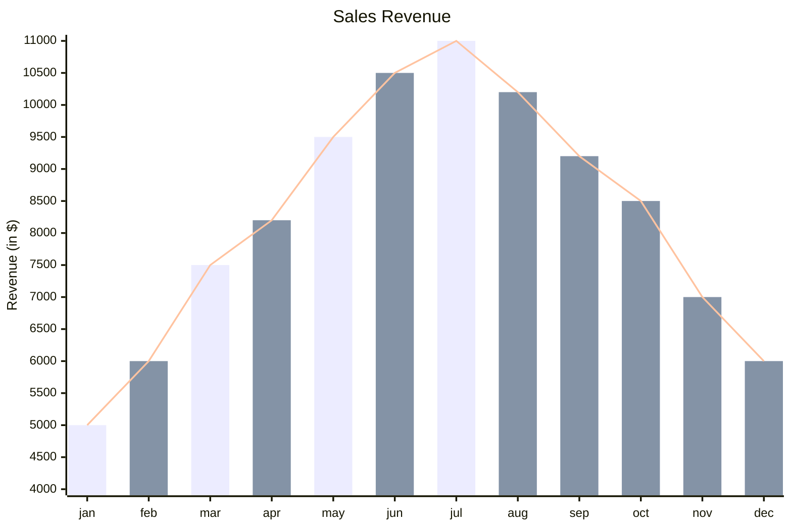

```mermaid
---
config:
    xyChart:
        width: 900
        height: 600
---
xychart-beta
    title "Sales Revenue"
    x-axis [jan, feb, mar, apr, may, jun, jul, aug, sep, oct, nov, dec]
    y-axis "Revenue (in $)" 4000 --> 11000
    bar [5000, 0, 7500,0 , 9500, 0, 11000,0 , 9200, 8500, 7000, 6000]
    bar [0, 6000, 0, 8200,0 , 10500,0 , 10200, 9200, 8500, 7000, 6000]
    line [5000, 6000, 7500, 8200, 9500, 10500, 11000, 10200, 9200, 8500, 7000, 6000]

```
